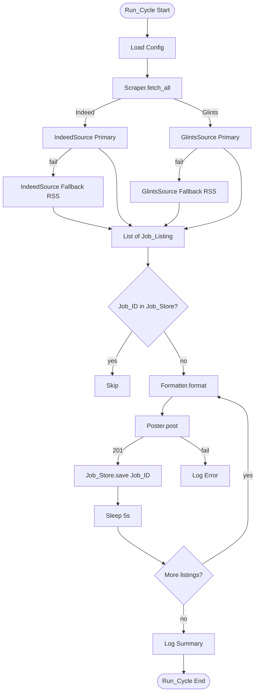
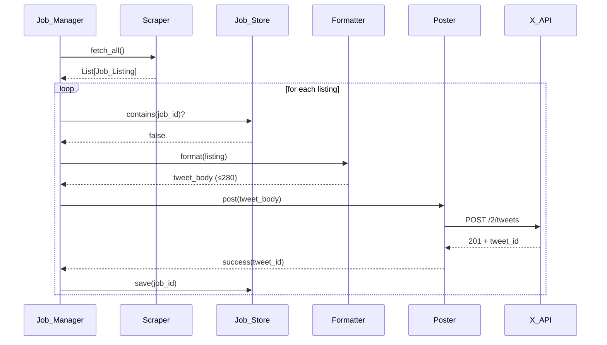

# Design Document: Job Vacancy Twitter Bot

## Overview

The Job Vacancy Twitter Bot is a modular Python 3.10+ application that runs a scheduled pipeline: scrape Indeed Indonesia and Glints Indonesia for remote/WFH/freelance roles, deduplicate against a local store, format each new listing into a 280-character tweet, post via X API v2 (OAuth 2.0), and persist posted Job IDs.

The design is organized around four cohesive modules — **Scraper**, **Formatter**, **Poster**, and **Job_Manager** — with a fifth supporting layer for configuration and persistence. Each module exposes a narrow, type-annotated interface that can be tested in isolation. The Scraper is built around an abstract `JobSource` so that primary (browser-driven scraping) and fallback (RSS/aggregator) implementations are interchangeable per source.

The runtime has two deployment modes: a single-shot mode (one Run_Cycle then exit, used by GitHub Actions cron), and a long-running mode using the Python `schedule` library. Both share the same `Job_Manager.run_once()` entry point.

### Key Design Decisions

| Decision | Choice | Rationale |
|---|---|---|
| HTTP/Browser library | `playwright` with stealth plugins as primary; `httpx` for RSS fallback | Indeed and Glints actively block headless requests with Cloudflare/WAF. Playwright with stealth handles JS rendering and TLS fingerprinting. `nodriver` is an alternative but Playwright is more mature with broader documentation. |
| Twitter library | `tweepy>=4.14` with `Client` (v2 API) | Native support for OAuth 2.0 User Context, automatic token refresh, structured rate-limit handling. |
| Persistence | SQLite via `sqlite3` stdlib | Atomic writes, ACID guarantees survive crash mid-cycle, no extra dependency. JSON file is acceptable but loses atomicity on concurrent runs. |
| Job_ID derivation | `sha256(source + ":" + source_native_id)` truncated to 16 hex chars | Stable across runs, collision-resistant, source-prefixed to avoid cross-source collisions. |
| Configuration | `pydantic-settings` reading from environment | Validated typed config, fails fast on missing variables, never echoes secrets in `__repr__`. |
| Logging | `logging` stdlib with structured formatter | Zero deps, pluggable into GitHub Actions log capture. |

## Architecture

### High-Level Flow



### Module Layout

```
job-vacancy-twitter-bot/
├── main.py                  # Entry point: run_once() or run_scheduled()
├── config.py                # pydantic-settings AppConfig
├── job_store.py             # SQLite Job_Store
├── models.py                # Job_Listing dataclass
├── scraper/
│   ├── __init__.py          # Aggregate Scraper.fetch_all()
│   ├── base.py              # JobSource abstract base class
│   ├── indeed.py            # IndeedSource (Playwright + RSS fallback)
│   └── glints.py            # GlintsSource (Playwright + RSS fallback)
├── formatter.py             # Tweet_Body construction + truncation
├── twitter_client.py        # Poster wrapping tweepy.Client
├── job_manager.py           # Pipeline orchestrator
├── requirements.txt
├── README.md
└── .github/workflows/bot.yml  # GitHub Actions cron
```

### Sequence: Single Job Posting



## Components and Interfaces

### `models.py`

```python
from dataclasses import dataclass
from typing import Optional

@dataclass(frozen=True)
class JobListing:
    job_id: str           # sha256(source + ":" + native_id)[:16]
    title: str
    company: str
    location: str         # "Remote" if WFH/Remote
    salary: Optional[str]
    url: str              # Application Link (absolute URL)
    source: str           # "indeed" | "glints"
```

### `scraper/base.py`

```python
from abc import ABC, abstractmethod
from typing import List
from models import JobListing

class JobSource(ABC):
    name: str

    @abstractmethod
    def fetch(self, limit: int) -> List[JobListing]:
        """Return up to `limit` recent listings. Raises on unrecoverable failure."""

class FallbackJobSource(JobSource):
    """Marker subclass for fallback (RSS) sources."""
```

### `scraper/__init__.py`

```python
def fetch_all(sources: list[tuple[JobSource, FallbackJobSource]],
              limit_per_source: int) -> list[JobListing]:
    """For each (primary, fallback), try primary then fallback on failure.
    Discards listings missing required fields. Returns aggregated list."""
```

### `formatter.py`

```python
TWEET_LIMIT = 280
HASHTAGS = "#RemoteJobs #WFH #Freelance #LokerRemote"

def format_tweet(listing: JobListing) -> str:
    """Returns Tweet_Body of length ≤ 280. Truncates `title` with `…`
    if needed; never truncates URL."""
```

### `twitter_client.py`

```python
class PostResult:
    success: bool
    tweet_id: Optional[str]
    error_code: Optional[int]
    error_message: Optional[str]

class Poster:
    def __init__(self, oauth_token: str, client_id: str, client_secret: str): ...
    def post(self, body: str) -> PostResult: ...
        # Handles 429 (wait per x-rate-limit-reset, retry once),
        # 5xx (3 retries exponential backoff from 2s),
        # 4xx other than 429 (no retry, return failure).
```

### `job_store.py`

```python
class JobStore:
    def __init__(self, db_path: str): ...
    def contains(self, job_id: str) -> bool: ...
    def save(self, job_id: str, tweet_id: str, posted_at: datetime) -> None: ...
    def all_ids(self) -> set[str]: ...
```

### `job_manager.py`

```python
@dataclass
class CycleSummary:
    fetched: int
    skipped_duplicate: int
    posted: int
    failed: int

class JobManager:
    def run_once(self) -> CycleSummary: ...
```

### `config.py`

```python
class AppConfig(BaseSettings):
    oauth_token: SecretStr
    x_client_id: SecretStr
    x_client_secret: SecretStr
    indeed_search_url: str
    glints_search_url: str
    run_interval_minutes: int = 60
    db_path: str = "posted_jobs.sqlite"
    listings_per_source: int = 10
    inter_post_delay_seconds: int = 5
    inter_request_delay_seconds: int = 2
```

## Data Models

### Job_Listing

| Field | Type | Constraints |
|---|---|---|
| job_id | str | 16 hex chars; required; unique key |
| title | str | non-empty; required |
| company | str | non-empty; required |
| location | str | non-empty; defaults to `"Remote"` |
| salary | Optional[str] | nullable |
| url | str | valid HTTP(S) URL; required |
| source | str | one of `{"indeed", "glints"}` |

### Job_Store Schema (SQLite)

```sql
CREATE TABLE IF NOT EXISTS posted_jobs (
    job_id    TEXT PRIMARY KEY,
    tweet_id  TEXT NOT NULL,
    posted_at TEXT NOT NULL  -- ISO-8601 UTC
);
CREATE INDEX IF NOT EXISTS idx_posted_at ON posted_jobs(posted_at);
```

### CycleSummary

| Field | Type | Description |
|---|---|---|
| fetched | int | Total Job_Listings returned from all sources |
| skipped_duplicate | int | Count rejected by deduplication |
| posted | int | Successful tweets |
| failed | int | Listings that failed to post |

## Correctness Properties

A property is a characteristic or behavior that should hold true across all valid executions of a system — essentially, a formal statement about what the system should do. Properties serve as the bridge between human-readable specifications and machine-verifiable correctness guarantees. The properties below are universally quantified ("for all") and intended to be exercised by property-based testing.

### Property 1: Scraper output structural completeness

*For any* batch of raw HTML/RSS payloads (including malformed entries), every `JobListing` returned by `Scraper.fetch_all` SHALL have a non-empty `title`, non-empty `company`, syntactically valid HTTP(S) `url`, non-empty `source`, and a 16-character hex `job_id`. Listings with missing required fields or that raise parsing exceptions SHALL be excluded.

**Validates: Requirements 1.3, 1.8, 7.2**

### Property 2: Scraper count bound

*For any* configured `limit_per_source` and any source that supplies at least `limit_per_source` valid listings, `Scraper.fetch_all` SHALL return at most `limit_per_source` listings from that source. For sources supplying fewer valid listings, it SHALL return exactly the number available.

**Validates: Requirements 1.4**

### Property 3: Inter-request delay

*For any* sequence of two consecutive HTTP requests issued by a single `JobSource` instance during a Run_Cycle, the elapsed wall time between request issuance SHALL be at least `inter_request_delay_seconds` (default 2 seconds).

**Validates: Requirements 1.5**

### Property 4: Source resilience via fallback

*For any* configuration where the primary `JobSource` for a portal raises an exception but the corresponding `FallbackJobSource` succeeds, `Scraper.fetch_all` SHALL return the listings from the fallback for that portal. *For any* configuration where one portal's primary and fallback both fail, the listings from the other portal's working tier SHALL still be present in the result.

**Validates: Requirements 1.6, 1.7, 7.1**

### Property 5: Job_Store round-trip persistence

*For any* set `S` of `(job_id, tweet_id, posted_at)` tuples saved via `JobStore.save`, after closing and reopening the store at the same `db_path`, `JobStore.all_ids()` SHALL return a set equal to `{t.job_id for t in S}`.

**Validates: Requirements 2.4**

### Property 6: Duplicate suppression

*For any* Run_Cycle and any Job_Listing whose `job_id` is present in `JobStore` at the start of the cycle, the `Formatter` and `Poster` SHALL NOT be invoked for that listing.

**Validates: Requirements 2.2, 2.3**

### Property 7: Persistence iff post succeeds

*For any* Run_Cycle and any non-duplicate Job_Listing processed during the cycle, after the cycle the `JobStore` SHALL contain that listing's `job_id` if and only if `Poster.post` returned a success result for that listing.

**Validates: Requirements 2.1, 2.5**

### Property 8: Tweet length bound

*For any* `JobListing` with non-empty `title`, `company`, `location`, and valid `url`, `format_tweet(listing)` SHALL return a string of length at most 280 characters.

**Validates: Requirements 3.1**

### Property 9: Tweet content completeness

*For any* `JobListing`, `format_tweet(listing)` SHALL contain the `company` substring, the `location` substring, the exact `url` substring, and each of the four hashtags `#RemoteJobs`, `#WFH`, `#Freelance`, `#LokerRemote`. *For any* listing whose `salary` is non-null and whose inclusion does not violate the 280-character bound, the formatted tweet SHALL contain the `salary` substring.

**Validates: Requirements 3.2, 3.3, 3.5**

### Property 10: Truncation correctness

*For any* `JobListing` whose untruncated formatted form would exceed 280 characters, `format_tweet(listing)` SHALL contain the `url`, `company`, `location`, and all four hashtags unmodified, and the substring corresponding to the title in the output SHALL end with the ellipsis character `…`.

**Validates: Requirements 3.4**

### Property 11: Single URL in tweet

*For any* `JobListing` whose `title`, `company`, and `location` fields do not themselves contain `listing.url`, the count of occurrences of `listing.url` in `format_tweet(listing)` SHALL be exactly 1.

**Validates: Requirements 3.6**

### Property 12: Successful post returns tweet ID

*For any* `tweet_body` of length 1 to 280 characters, when the underlying X_API mock returns HTTP 201 with body `{"data": {"id": <tweet_id>}}`, `Poster.post(tweet_body)` SHALL return a `PostResult` with `success=True` and `tweet_id=<tweet_id>`, and SHALL have submitted exactly one HTTP request to the path `/2/tweets`.

**Validates: Requirements 4.2, 4.3**

### Property 13: 429 retry behavior

*For any* HTTP 429 response with header `x-rate-limit-reset=<epoch>`, `Poster.post` SHALL sleep for `max(0, <epoch> - now)` seconds (capped at 15 minutes when the header is absent) and SHALL issue exactly one retry. If the retry succeeds with 201, the result SHALL be success; otherwise, failure with the retry's status code.

**Validates: Requirements 4.4**

### Property 14: 5xx retry behavior

*For any* sequence of HTTP responses where the first `k` (for `0 ≤ k ≤ 4`) are 5xx and the next is either 201 or absent, `Poster.post` SHALL issue at most 4 total HTTP attempts (1 initial + up to 3 retries), with sleeps of 2s, 4s, 8s between attempts. The result SHALL be success if a 201 occurs within those 4 attempts, otherwise failure.

**Validates: Requirements 4.5**

### Property 15: 4xx no retry

*For any* HTTP response with status code in `{400, 401, 403, 404, 422}`, `Poster.post` SHALL return a failure `PostResult` with the corresponding status code and SHALL issue exactly one HTTP request.

**Validates: Requirements 4.6, 4.7**

### Property 16: Inter-post delay

*For any* Run_Cycle producing two or more successful posts, the elapsed wall time between the start of consecutive `Poster.post` invocations SHALL be at least `inter_post_delay_seconds` (default 5 seconds).

**Validates: Requirements 5.3**

### Property 17: Failure isolation

*For any* Run_Cycle with a list of `n` non-duplicate `JobListing`s where exactly the listings at indices `F ⊆ {0, …, n-1}` cause `Poster.post` to return failure, exactly the listings at indices `{0, …, n-1} \ F` SHALL be persisted in the `JobStore`, and `Poster.post` SHALL be invoked exactly `n` times.

**Validates: Requirements 5.2**

### Property 18: Cycle accounting invariant

*For any* Run_Cycle, the returned `CycleSummary` SHALL satisfy `fetched == skipped_duplicate + posted + failed`, and each count SHALL be non-negative.

**Validates: Requirements 5.1, 7.5**

### Property 19: Config validation

*For any* environment variable assignment that omits at least one required variable from `{OAUTH_TOKEN, X_CLIENT_ID, X_CLIENT_SECRET, INDEED_SEARCH_URL, GLINTS_SEARCH_URL}`, instantiating `AppConfig` SHALL raise a validation error whose message contains the name of the first missing variable.

**Validates: Requirements 6.1, 6.2**

### Property 20: Credentials never logged

*For any* Run_Cycle execution, no log record (at any level) SHALL contain the literal value of `oauth_token`, `x_client_id`, or `x_client_secret`.

**Validates: Requirements 6.3**

### Property 21: Success log contains both IDs

*For any* successful tweet post during a Run_Cycle, exactly one log record at INFO level SHALL be emitted, and that record SHALL contain both the `job_id` and the `tweet_id` as substrings.

**Validates: Requirements 7.3**

### Property 22: Error log on failure

*For any* `JobListing` whose post fails during a Run_Cycle, at least one log record at ERROR level SHALL be emitted, and that record SHALL contain the `job_id` as a substring.

**Validates: Requirements 7.4**

## Error Handling

### Error Categories and Responses

| Error Source | Trigger | Response |
|---|---|---|
| Network (connection refused, DNS failure, timeout) on Scraper | Primary scrape | Catch in `JobSource.fetch`, log WARNING with source name, return empty list to trigger fallback |
| Network on Fallback | RSS request fails | Catch, log ERROR with source name, return empty list; Job_Manager continues with other source |
| DOM parsing exception per listing | Malformed HTML element | Catch in per-listing parser, log WARNING with element snippet (truncated to 200 chars), skip element |
| X_API HTTP 429 | Rate limit | Sleep per `x-rate-limit-reset` header, retry once. If still 429, return failure (Property 13) |
| X_API HTTP 5xx | Server error | Retry up to 3 times, exponential backoff 2s/4s/8s. Final failure logged at ERROR (Property 14) |
| X_API HTTP 4xx (≠ 429) | Client error (auth, invalid body, duplicate content) | Return failure immediately, log ERROR with status and message (Property 15) |
| OAuth token invalid/missing | Startup or 401 from API | Log ERROR `"Authentication failed"` without echoing token value, return failure (Property 20) |
| SQLite write error | Disk full, permission denied | Log ERROR with path, abort current Run_Cycle to prevent data inconsistency, exit code 1 |
| Required env var missing | `AppConfig()` instantiation | Raise `ConfigError` with missing variable name, exit code 2 (Property 19) |
| Single Job_Listing post failure | Any reason | Log ERROR, increment `failed` counter, do not save Job_ID, continue cycle (Property 17, 22) |

### Logging Convention

All logs use a structured format: `<timestamp> <level> <module> <message> <key=value pairs>`.

Sensitive fields (`oauth_token`, `client_secret`) are wrapped in `pydantic.SecretStr` and never appear in `__repr__` or log output. The logger has a global filter that redacts known credential values from any log record (Property 20).

### Cycle-Level Recovery

The `Job_Manager.run_once()` method is wrapped in a top-level try/except that catches any uncaught exception, logs it at CRITICAL, and returns a `CycleSummary` with `failed = fetched - skipped_duplicate - posted` so that the accounting invariant (Property 18) is preserved.

## Testing Strategy

### Approach

Testing combines **unit tests** (specific examples and edge cases) with **property-based tests** (universal properties from the section above). Each correctness property is implemented by exactly one property-based test; each unit test targets a specific scenario, error path, or integration point.

### Tools

- **Test runner**: `pytest>=7.4`
- **Property-based testing library**: `hypothesis>=6.92`
- **HTTP mocking**: `respx` (for `httpx`) and `pytest-mock`
- **Time control**: `freezegun` for deterministic sleep/timestamp assertions
- **Coverage**: `pytest-cov` (target ≥85% line coverage)

### Property-Based Test Configuration

- Each `hypothesis` test runs a minimum of **100 examples** (`@settings(max_examples=100)`).
- Each test is annotated with a comment of the form:
  `# Feature: job-vacancy-twitter-bot, Property N: <property text>`
- Custom strategies are defined for `JobListing` (with realistic title/company/url generators) and for HTTP response sequences (for retry properties).

### Test Organization

```
tests/
├── unit/
│   ├── test_formatter_examples.py       # Specific tweet examples & edge strings
│   ├── test_job_store_examples.py       # SQLite read/write specific cases
│   ├── test_twitter_client_examples.py  # Specific API responses
│   ├── test_scraper_examples.py         # Fixture HTML parsing
│   └── test_config_examples.py          # Specific env configurations
├── property/
│   ├── test_scraper_properties.py       # Properties 1, 2, 3, 4
│   ├── test_job_store_properties.py     # Properties 5, 6, 7
│   ├── test_formatter_properties.py     # Properties 8, 9, 10, 11
│   ├── test_twitter_client_properties.py# Properties 12, 13, 14, 15
│   ├── test_job_manager_properties.py   # Properties 16, 17, 18
│   ├── test_config_properties.py        # Property 19
│   └── test_logging_properties.py       # Properties 20, 21, 22
└── fixtures/
    ├── indeed_sample.html
    ├── glints_sample.html
    └── rss_sample.xml
```

### Unit Test Focus Areas

- Concrete tweet examples for known job listings (English + Indonesian titles).
- Specific HTTP responses (201 with malformed body, 401 with WWW-Authenticate, 429 without reset header).
- SQLite migration when DB file does not exist.
- Parsing fixtures from real Indeed/Glints HTML snapshots stored in `tests/fixtures/`.
- CLI invocation of `main.py` exits with the correct status code.

### Property Test Focus Areas

Each property from the Correctness Properties section maps to one property-based test. Strategies are designed to cover:

- **Listings**: titles up to 500 chars (forces truncation), Unicode characters (Indonesian, emoji), missing optional fields, malformed URLs (rejected by validation).
- **HTTP responses**: arbitrary status code sequences for retry tests, varying header presence.
- **Job sets**: random combinations of duplicate/new listings, random failure positions for failure-isolation tests.
- **Time**: simulated clocks via `freezegun` to verify delay properties without real waits.

### Continuous Integration

GitHub Actions runs `pytest tests/ --cov=. --cov-report=term --cov-fail-under=85` on every push. Property tests use a fixed `hypothesis` seed in CI for reproducibility.
